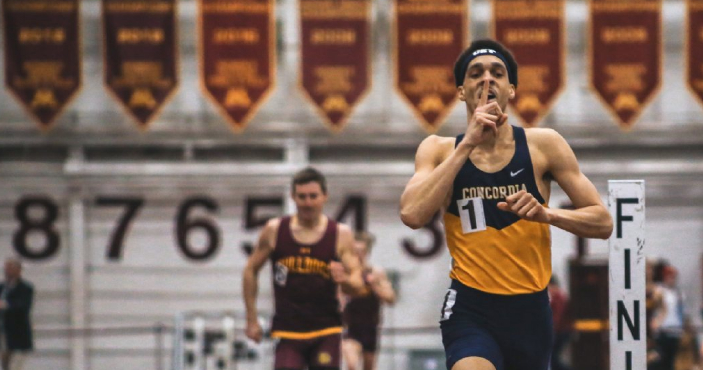

# Responsive images

## Background images with media queries

For this example we will use 2 images

1. Portrait (mobile)
2. Landscape (Desktop)

```html
<div class="hero-banner">
  <div class="container">
    <h1>Hero banner</h1>
  </div>
</div>
```

```css
.hero-banner {
  height: 420px;
  margin: 0 auto;
}

.bg-image-no-repeat-cover {
  background-repeat: no-repeat;
  background-size: cover;
  background-position: top left;
}

@media screen and (max-width: 767px) {
  /* Mobile */
  .bg-runner {
    background-image: url('../path/to/mobile-image.jpg');
  }
}

@media screen and (min-width: 768px) {
  /* Tablet */
  .bg-runner {
    background-image: url('../path/to/tablet-image.jpg');
  }
}

@media screen and (min-width: 1024px) {
  /* Desktop */
  .bg-runner {
    background-image: url('../path/to/desktop-image.jpg');
  }
}

@media screen and (min-width: 1280px) {
  /* Bigger Desktop */
  .bg-runner {
    background-image: url('../path/to/bigger-desktop-image.jpg');
  }
}
```

### Pros

- easy to implement
- good for background images on hero banners and call to actions

### Cons

- Managing it is painful on larger projects
- can double load images if you not careful with your queries
- not scalable for product galleries

## Image tag and srcset

source: [MDN](https://developer.mozilla.org/en-US/docs/Learn/HTML/Multimedia_and_embedding/Responsive_images)

```html

```

We can however use two new attributes — srcset and sizes — to provide several additional source images along with hints to help the browser pick the right one.

```html
  
```

### Pros

- fairly simple to build
- scalable with scripting.
- fallback image

### Cons

- more complex than media queries way, but better.
- no background image property, so limited styling opportunity


## Picture and Source tag 🦄

Best option

```html
  <picture>
      <source media="(max-width: 767px)" srcset="./img/mobile-banner.jpg">
      <source media="(min-width: 768px)" srcset="./img/tablet-banner.jpg">
      <source media="(min-width: 1025px)" srcset="./img/desktop-banner.jpg">
      
    </picture>
```

### Pros

- semantic html tags
- also simple, easy to read or reason about
- fallback image
